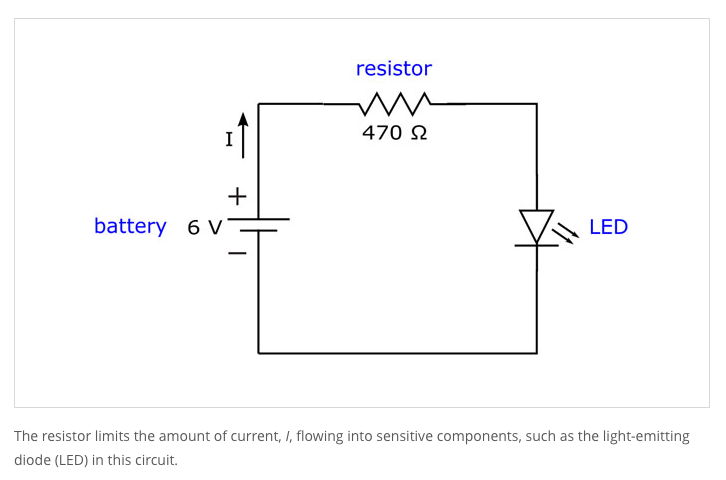

# Resistor Colour

From Exercism Python track, and working towards #100daysofcode

The esrcise is here 👉 [Resistor Color](https://exercism.org/tracks/python/exercises/resistor-color)

## Instructions

Resistors are electronic components used to limit the current in part of a circuit as well as controlling the amoiunt of voltage provided to a part of a circuit. 

Having too much current pass through a circuit can destroy sensitive components. 

To limit the current, a resistor is placed at the input of a sensitive part. Limiting the current too much means that the part we are trying to get the current to might not have enough electricity to function. 

- Resistors have different resistance values
- Resistance values are denoted using colour bands.

Each band has a position and a numeric value. 

The first two bands map to a numeric value each using the colour of the band as a reference:

- Black: 0
- Brown: 1
- Red: 2
- Orange: 3
- Yellow: 4
- Green: 5
- Blue: 6
- Violet: 7
- Grey: 8
- White: 9

Create a way to:

- look up the numerical value associated with a particular colour band
- list the different band colours

Mnemonics map the colors to the numbers, that, when stored as an array, happen to map to their index in the array: Better Be Right Or Your Great Big Values Go Wrong.

Source:
[Maud de Vries, Erik Schierboom](https://exercism.org/tracks/python/exercises/resistor-color#:~:text=code%20Wikipedia%20article-,Source,-Maud%20de%20Vries)